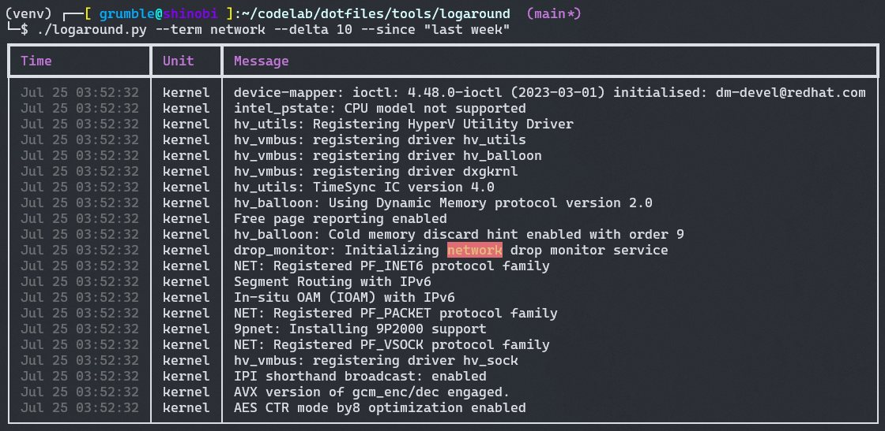

# logaround.py

**A friendlier way to dig through your Linux system logs.**  
Color highlighting, instant context, human time formats, and powerful filtering—right from the CLI.

---

## Features

- **Search by Text or Time:** Jump straight to any log message or timestamp.
- **Color Highlighting:** Instantly spot matches in busy logs.
- **Human Time Support:** Use `"last Tuesday 14:00"`, `"yesterday"`, `"2 days ago 11:30"`, etc.
- **Context-Aware:** Get N lines before/after every match—like `grep -A/-B`, but smarter.
- **Pandas DataFrame Under the Hood:** Hackable, extendable, perfect for power users.
- **Never Drops Lines:** Even weird or multi-line log messages are kept.
- **Zero Dependencies Except Rich, Pandas, and GNU date.**


---




---

## Install

```sh
pip install pandas rich
# On Debian/Ubuntu, you probably already have GNU date (coreutils)
```

## Usage 
```bash
./logaround.py --term sshd --delta 5
./logaround.py --term "network error" --since "yesterday 18:00" --until "today 03:00" --delta 10
./logaround.py --since "last Monday 09:00" --term apache --max 200
./logaround.py --help
./logaround.py --version
```

### **Main Options**
- `--term STR` 
  Search for this term (repeatable, AND logic)

- `--delta N` 
  Show ±N context lines around matches

- `--since TIME` 
  Start time (any date -d-friendly string)

- `--until TIME` 
  End time (same as above)

- `--lines N` 
  How many log lines to load (default: 500)

- `--max N Max` 
  results to display (default: 100)

- `-h`, `--help` 
  Show help message and exit

- `-v`, `--version` 
  Show program version and exit


  ### Examples 

```bash
# Show sshd events yesterday, with 10 lines of context
./logaround.py --term sshd --since "yesterday" --delta 10

# All apache log messages from last week, up to 200 results
./logaround.py --term apache --since "last week" --max 200

# Simple search, just show context for errors
./logaround.py --term error --delta 5

# Show what happened between two custom times
./logaround.py --since "2024-07-30 09:00" --until "2024-07-30 13:00" --term "systemd"
```

## Timestamp Limitations

- The tool supports **any time string GNU `date` will parse**:
    - `"2024-07-30 13:41:12"`
    - `"yesterday 22:00"`
    - `"1 week ago"`
    - `"last Friday 17:30"`
    - `"now"`, `"midnight"`, `"tomorrow"`, etc.
- If your time isn’t parsed, it falls back to showing logs without a time filter.
- See [`man date`](https://man7.org/linux/man-pages/man1/date.1.html) or the  
  [GNU date documentation](https://www.gnu.org/software/coreutils/manual/html_node/date-invocation.html)  
  for all supported human-friendly formats.

---

## Output & Customization

- Results are displayed in a colorized table with time, unit, and message columns.
- Search terms are highlighted (case-insensitive).
- Context lines are shown in log order with no duplicates.
- All code is hackable—edit, filter, or export as you see fit!

---

## Why Use logaround.py?

- Faster troubleshooting—jump to any moment, see what happened before/after
- Works well for debugging, incident response, or "what the hell happened" moments
- More control and better visuals than raw `journalctl` or `grep`

---

## Requirements

- Python 3.8+
- `pandas`, `rich`
- `journalctl` (systemd-based systems)
- GNU `date` (for flexible time parsing; default on most Linux distros)

---

## License

MIT (or your choice)

---

## Author

forfaxx ([adminjitsu.com](https://adminjitsu.com))

Feedback, bugs, or log wizardry?  
[Email me!](mailto:feedback@adminjitsu.com)

